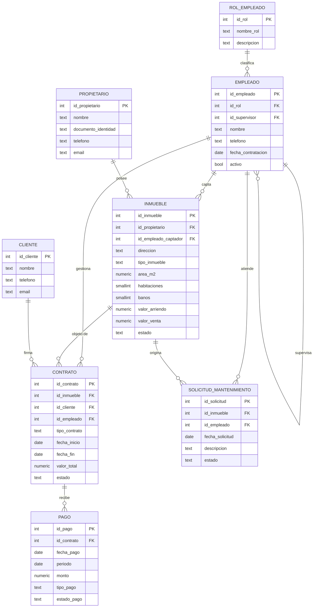

# Dominio de negocio — Inmobiliaria

Este proyecto modela la operación de una **inmobiliaria** que administra inmuebles
en arriendo o venta a nombre de terceros (propietarios). Un equipo de empleados,
organizado en una jerarquía simple (director → coordinadores → asesores /
personal de mantenimiento), capta inmuebles, gestiona contratos con clientes y
da seguimiento a los pagos y solicitudes de mantenimiento de cada inmueble. El
esquema cubre el ciclo completo: captación del inmueble, firma del contrato,
registro de pagos (incluyendo abonos parciales dentro de un mismo periodo) y
solicitudes de mantenimiento asociadas al inmueble.

## Diagrama entidad-relación

## Entidades

- **rol_empleado / empleado** — jerarquía interna del equipo (director,
  coordinador, asesor comercial, mantenimiento). Un empleado puede supervisar
  a otros (`id_supervisor` referencia a `empleado`).
- **propietario** — dueño del inmueble, ajeno a la operación de la inmobiliaria.
- **cliente** — quien arrienda o compra un inmueble.
- **inmueble** — captado por un empleado a nombre de un propietario; tiene
  precio de arriendo y/o de venta, y un estado (`disponible`, `arrendado`,
  `vendido`, `retirado`).
- **contrato** — vincula un inmueble, un cliente y el empleado responsable;
  puede ser de arriendo (con fecha de fin obligatoria) o de venta.
- **pago** — pagos asociados a un contrato, agrupados por `periodo` (mes). Un
  mismo periodo puede tener varios pagos si el cliente paga en abonos.
- **solicitud_mantenimiento** — reportes sobre un inmueble, opcionalmente
  asignados a un empleado de mantenimiento.

Este diagrama refleja el esquema tal como queda tras aplicar todas las
migraciones en `sql_migrations/` (baseline + evolutivas + repetible).
