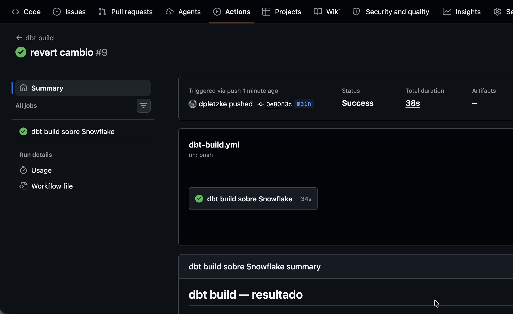
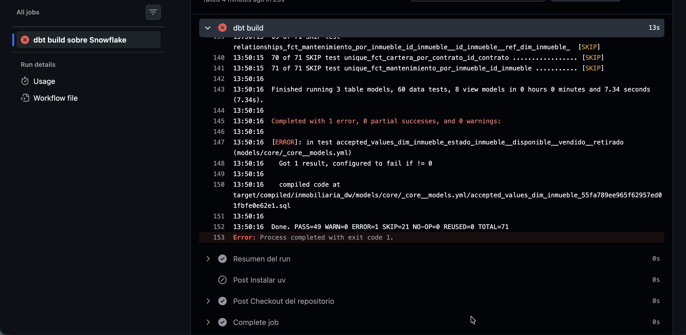

# Evidencia — GitHub Actions: dbt build

> Completar tras la primera corrida real del workflow `.github/workflows/dbt-build.yml`.

## Corrida exitosa

- **Enlace al run:** https://github.com/dpletzke/data-ops-Inmobiliaria/actions/runs/33256121498
- **Disparado por:** _(push)_
- **Resultado:** ✅ success — `dbt build` materializó N modelos y pasó M tests.

## Corrida en rojo — fallo visible de un test

> Demuestra que el workflow falla cuando un test no pasa (rúbrica C4, nivel Excelente).

- **Cómo se provocó:** se eliminó un valor de la lista de valores aceptados en el test `accepted_values` del modelo `core__propiedades` (ver commit de reversión).
- **Enlace al run fallido:** https://github.com/dpletzke/data-ops-Inmobiliaria/actions/runs/33256013227
- **Resultado:** ❌ failure — el step `dbt build` corta y los modelos Gold dependientes no se construyen.

 